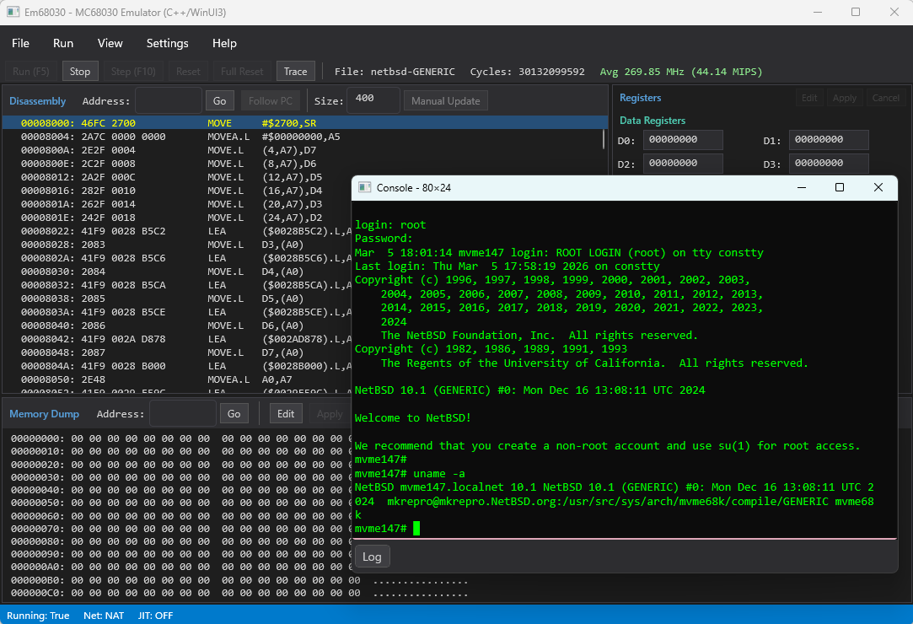

# Em68030 - MC68030 Emulator (C++ / WinUI 3)

An emulator for the [Motorola MC68030](https://en.wikipedia.org/wiki/Motorola_68030) microprocessor, a 32-bit CPU from the late 1980s used in workstations, embedded systems, and single-board computers. This emulator targets the [MVME147](https://en.wikipedia.org/wiki/MVME147), a VMEbus single-board computer built around the MC68030, and can boot [NetBSD/mvme68k](https://www.netbsd.org/ports/mvme68k/), the mvme68k port of the NetBSD operating system.

This is the high-performance C++/WinRT + WinUI 3 port of the [C# WPF version](https://github.com/hha0x617/Em68030_CsWpf). Developed through vibe coding with [Claude Code](https://docs.anthropic.com/en/docs/claude-code).

[Japanese documentation (README_ja.md)](README_ja.md)

<a href="docs/screenshot_jit_off.png"></a>

**Documentation**: [Getting Started](docs/getting_started.md) | [Instruction Set](docs/instruction_set.md) | [Hardware Platform](docs/hardware_platform.md)

## Features

### CPU Emulation
- Full MC68030 instruction set (including privileged instructions)
- MMU (page table walk, ATC, transparent translation, PTEST)
- MC68882-compatible FPU (FP0-FP7, FPCR/FPSR/FPIAR)
- Bus error recovery (Format A stack frame)

### Board Emulation (MVME147)
| Device | Emulation |
|---|---|
| WD33C93 SCSI Controller | Hard disk and CD-ROM (multiple units) |
| AM7990 LANCE Ethernet | Virtual network (ARP/ICMP/TCP/UDP) / NAT (host network) |
| Z8530 SCC Serial | VT100 terminal emulation |
| Mk48t02 RTC | Real-time clock |
| PCC | Interrupt controller, wall-clock timer |

### Debugger UI
- Disassembly view (auto-follow PC, address jump)
- Register display and editing (D0-D7, A0-A7, PC, SR, SSP, VBR, FP0-FP7)
- Memory dump and editing
- Breakpoints
- Console window (VT100 terminal with scrollback and paste support)
- ELF / S-Record / binary file loading
- Warm reboot (RESET instruction) and halt detection

### Performance
Achieves ~44.14 MIPS (~269.85 MHz estimated) on an Intel Core i7-13700. The status bar displays both approximate MHz (cycle-based) and MIPS (instruction throughput). Key optimizations:

- 65,536-entry opcode dispatch table
- Specialized fast handlers for frequent instructions (MOVEQ, MOVE.L, Bcc.B, RTS, etc.)
- Inline fast path for direct ATC lookup
- Data page cache (1-entry read cache)
- Deferred register snapshot
- Approximate cycle table (65,536-entry lookup with EA cost calculation)
- Experimental JIT compiler for register-only basic blocks (pre-decoded switch dispatch)

The JIT compiler scans hot basic blocks consisting of register-only instructions and pre-decodes them into a `JitOp` array executed via switch dispatch. This avoids per-instruction decode overhead for tight loops. Enable via Settings > Performance > JIT Compiler. Note: the benefit depends on workload; most real-world code contains memory accesses that cannot be JIT-compiled.

**Supported JIT instructions**: MOVEQ, MOVE.L Dn→Dm, MOVE.L An→Dn, MOVEA.L Dn→An, MOVEA.L An→Am, CLR.L Dn, TST.L Dn, ADD/SUB/CMP.L Dn→Dm, AND/OR/EOR.L Dn→Dm, ADDQ/SUBQ.L Dn, ADDQ/SUBQ An, ASL/ASR/LSL/LSR.L #imm Dn, EXG Dn↔Dm/An↔Am/Dn↔An, SWAP Dn, EXT.W/EXT.L/EXTB.L Dn, NEG.L Dn, NOT.L Dn, Bcc.B, BRA.B, NOP

## Requirements

- Windows 10 (1809) or later
- Visual Studio 2026 (v145 toolset)
- Windows App SDK / WinUI 3
- C++20

## Build

```bash
MSBuild Em68030_WinUI3Cpp.sln -p:Configuration=Release -p:Platform=x64
```

### NuGet Restore for Test Project (first time only)

```bash
nuget.exe restore Em68030.Tests/packages.config -PackagesDirectory Em68030/packages
```

## Test

```bash
vstest.console.exe Em68030\x64\Release\Em68030.Tests.exe
```

## Run

After building, run `Em68030\x64\Release\Em68030.exe`.

On first launch, an `appsettings.json` file is generated from the Settings menu.

> **Note**: Since the executable is not code-signed, Windows Defender SmartScreen may block it on first run. Click "More info" and then "Run anyway" to proceed. Alternatively, right-click the exe, open Properties, and check "Unblock" on the General tab.

## Configuration (appsettings.json)

```json
{
    "BoardType": "MVME147",
    "MemorySize": 67108864,
    "Mvme147ScsiDisks": [
        { "Path": "path/to/scsi0.img", "ScsiId": 0 }
    ],
    "Mvme147ScsiCdromPath": "path/to/NetBSD-10.1-mvme68k.iso",
    "Mvme147ScsiCdromId": 3,
    "NetworkMode": "Virtual",
    "ConsoleScrollbackLines": 2000
}
```

| Setting | Description | Default |
|---|---|---|
| `BoardType` | `"Generic"` or `"MVME147"` | `"Generic"` |
| `MemorySize` | RAM size in bytes | 48 MB |
| `Mvme147ScsiDisks` | List of SCSI disk images (Path + ScsiId) | `[]` |
| `Mvme147ScsiCdromPath` | SCSI CD-ROM ISO image path | `""` |
| `NetworkMode` | `"Virtual"` (echo server) or `"NAT"` (host network) | `"Virtual"` |
| `ConsoleScrollbackLines` | Console scrollback lines (0-100000) | 2000 |
| `JitEnabled` | Enable experimental JIT compiler | `false` |
| `JitMinBlockLength` | Minimum instruction count for JIT compilation | 3 |
| `JitCompileThreshold` | Execution count before a block is compiled | 32 |

## Booting NetBSD

1. Prepare a NetBSD/mvme68k disk image
2. In Settings, set `BoardType` to `MVME147` and specify the SCSI disk image path
3. Load a NetBSD kernel (`netbsd-GENERIC`) via File > Open ELF
4. Start execution with Run (F5)

## Project Structure

```
Em68030_WinUI3Cpp/
├── Em68030_WinUI3Cpp.sln
├── Em68030/
│   ├── Core/           MC68030, MMU, Memory, InstructionDecoder, ALU, FPU, JitCompiler
│   ├── IO/             SCSI, Ethernet, Serial, RTC, PCC devices
│   ├── Config/         EmulatorConfig (appsettings.json)
│   ├── ViewModels/     MainViewModel
│   ├── Views/          ConsoleWindow, BreakpointsWindow, SettingsWindow, AboutDialog
│   ├── ThirdParty/     nlohmann/json
│   └── MainWindow.xaml Main debugger UI
├── Em68030.Tests/      Google Test (268 tests)
└── installer/          Inno Setup installer script
```

## Limitations

### CPU
- FPU uses 64-bit double internally as an approximation of the MC68882's 80-bit extended precision. This does not affect normal OS operation but may produce different results in high-precision floating-point calculations
- FPU Packed Decimal format is not implemented
- FSAVE/FRESTORE are simplified (null/idle frame only)
- CACR/CAAR registers are readable and writable but hardware cache emulation is not performed
- PTEST level 0 ATC search is simplified
- Cycle timing is approximate: a 65,536-entry lookup table provides per-opcode cycle estimates with EA cost adjustments, but is not cycle-accurate to the real MC68030. Cycle count is used for MHz estimation only, not for timing control

### Devices
- **SCSI**: Only standard commands used by NetBSD are implemented; not the full SCSI-2 command set
- **Ethernet**: Virtual mode supports only ARP reply, ICMP Echo (ping), and TCP/UDP echo server. NAT mode connects to host network but does not support TAP/bridge
- **Serial (SCC)**: No baud rate simulation or modem control signals (RTS/CTS)
- **RTC**: Read-only implementation returning host system time. Time set by the guest OS is not persisted
- **NVRAM**: In-memory only; not persisted to file
- **PCC**: Printer port and watchdog timer are not implemented

### Board
- VMEbus is not implemented
- NetBSD kernel can be loaded and run directly without a ROM image (built-in boot stub)

## Roadmap

- Performance: Expand JIT to cover more instruction patterns
- FPU: Accurate 80-bit extended precision emulation
- NVRAM file persistence
- Graphics output (framebuffer)

## Related Projects

- [Em68030 C#/WPF version](https://github.com/hha0x617/Em68030_CsWpf) - Same emulator implemented in C#/.NET

## License

[Apache License 2.0](LICENSE)

## Trademarks

All product names, trademarks, and registered trademarks are the property of their respective owners.
