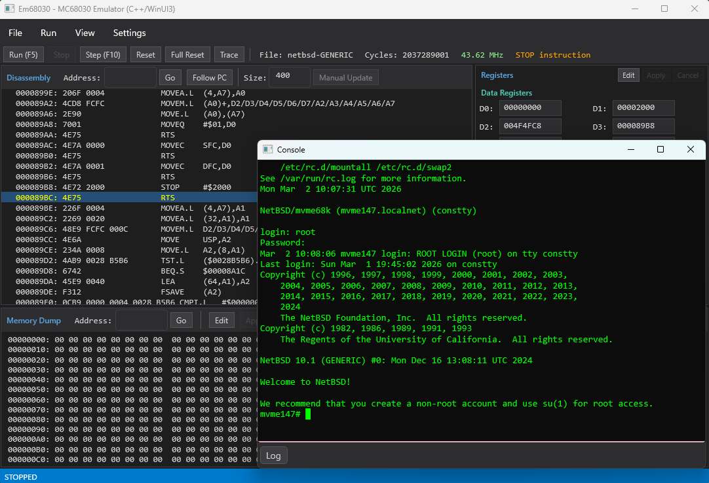

# Em68030 - MC68030 Emulator (C++ / WinUI 3)

[Motorola MC68030](https://en.wikipedia.org/wiki/Motorola_68030) マイクロプロセッサのエミュレータです。MC68030 は 1980 年代後半にワークステーションや組み込みシステムで広く使われた 32-bit CPU です。本エミュレータは MC68030 を搭載した VMEbus シングルボードコンピュータ [MVME147](https://en.wikipedia.org/wiki/MVME147) をエミュレートし、NetBSD の mvme68k ポートである [NetBSD/mvme68k](https://www.netbsd.org/ports/mvme68k/) を起動できます。

[C# WPF 版](https://github.com/hha0x617/Em68030_CsWpf) を C++/WinRT + WinUI 3 へポーティングした高速版です。[Claude Code](https://docs.anthropic.com/en/docs/claude-code) との vibe coding により開発されました。

[English documentation (README.md)](README.md)



## 特徴

### CPU エミュレーション
- MC68030 の全命令セット (特権命令を含む)
- MMU (ページテーブルウォーク、ATC、透過変換、PTEST)
- MC68882 互換 FPU (FP0-FP7、FPCR/FPSR/FPIAR)
- バスエラー回復 (Format A スタックフレーム)

### ボードエミュレーション (MVME147)
| デバイス | エミュレーション |
|---|---|
| WD33C93 SCSI コントローラ | ハードディスク・CD-ROM (複数台) |
| AM7990 LANCE Ethernet | 仮想ネットワーク (ARP/ICMP/TCP/UDP) / NAT (ホストネットワーク) |
| Z8530 SCC シリアル | VT100 ターミナルエミュレーション |
| Mk48t02 RTC | リアルタイムクロック |
| PCC | 割り込みコントローラ、実時間タイマー |

### デバッガ UI
- 逆アセンブリビュー (PC 自動追従、アドレスジャンプ)
- レジスタ表示・編集 (D0-D7, A0-A7, PC, SR, SSP, VBR, FP0-FP7)
- メモリダンプ・編集
- ブレークポイント
- コンソールウィンドウ (VT100 ターミナル、スクロールバック・ペースト対応)
- ELF / S-Record / バイナリファイルの読み込み
- ウォームリブート (RESET 命令) およびハルト検出

### パフォーマンス
i7-13700 上で 45-48 MHz 相当のエミュレーション速度を達成。主な最適化:

- 65,536 エントリのオペコードディスパッチテーブル
- 頻出命令の専用ファストハンドラ (MOVEQ, MOVE.L, Bcc.B, RTS 等)
- ATC 直接参照のインライン高速パス
- データページキャッシュ (1 エントリ読み取りキャッシュ)
- 遅延レジスタスナップショット

インタープリタ方式のため、1 命令あたりホスト CPU で約 100 サイクルを消費します。主なコスト要因は MMU アドレス変換 (ATC ルックアップ)、メモリアクセス、命令デコードとディスパッチです。JIT コンパイル方式への移行により大幅な高速化が見込めますが、MMU とバスエラー回復の正確なエミュレーションとの両立が課題となります。

## 必要環境

- Windows 10 (1809) 以降
- Visual Studio 2026 (v145 ツールセット)
- Windows App SDK / WinUI 3
- C++20

## ビルド

```bash
MSBuild Em68030_WinUI3Cpp.sln -p:Configuration=Release -p:Platform=x64
```

### テストプロジェクトの NuGet 復元 (初回のみ)

```bash
nuget.exe restore Em68030.Tests/packages.config -PackagesDirectory Em68030/packages
```

## テスト

```bash
vstest.console.exe Em68030\x64\Release\Em68030.Tests.exe
```

## 実行

ビルド後、`Em68030\x64\Release\Em68030.exe` を実行します。

初回起動後、Settings メニューから `appsettings.json` が生成されます。

> **注意**: 実行ファイルにコード署名がないため、初回実行時に Windows Defender SmartScreen によってブロックされることがあります。「詳細情報」をクリックし、「実行」を選択してください。または、exe ファイルを右クリックしてプロパティを開き、「全般」タブの「許可する」にチェックを入れてください。

## 設定 (appsettings.json)

```json
{
    "BoardType": "MVME147",
    "MemorySize": 67108864,
    "Mvme147ScsiDisks": [
        { "Path": "path/to/scsi0.img", "ScsiId": 0 }
    ],
    "Mvme147ScsiCdromPath": "path/to/NetBSD-10.1-mvme68k.iso",
    "Mvme147ScsiCdromId": 3,
    "NetworkMode": "Virtual",
    "ConsoleScrollbackLines": 2000
}
```

| 設定項目 | 説明 | デフォルト |
|---|---|---|
| `BoardType` | `"Generic"` または `"MVME147"` | `"Generic"` |
| `MemorySize` | RAM サイズ (バイト) | 48 MB |
| `Mvme147ScsiDisks` | SCSI ディスクイメージのリスト (Path + ScsiId) | `[]` |
| `Mvme147ScsiCdromPath` | SCSI CD-ROM ISO イメージパス | `""` |
| `NetworkMode` | `"Virtual"` (エコーサーバ) または `"NAT"` (ホストネットワーク) | `"Virtual"` |
| `ConsoleScrollbackLines` | コンソールのスクロールバック行数 (0-100000) | 2000 |

## NetBSD の起動

1. NetBSD/mvme68k のディスクイメージを用意する
2. Settings で `BoardType` を `MVME147` に設定し、SCSI ディスクイメージのパスを指定
3. File > Open ELF から NetBSD カーネル (`netbsd-GENERIC`) を読み込む
4. Run (F5) で実行開始

## プロジェクト構成

```
Em68030_WinUI3Cpp/
├── Em68030_WinUI3Cpp.sln
├── Em68030/
│   ├── Core/           MC68030, MMU, Memory, InstructionDecoder, ALU, FPU
│   ├── IO/             SCSI, Ethernet, Serial, RTC, PCC 等のデバイス
│   ├── Config/         EmulatorConfig (appsettings.json)
│   ├── ViewModels/     MainViewModel
│   ├── Views/          ConsoleWindow, BreakpointsWindow, SettingsWindow, AboutDialog
│   ├── ThirdParty/     nlohmann/json
│   └── MainWindow.xaml メインデバッガ UI
└── Em68030.Tests/      Google Test (156 tests)
```

## 制限事項

### CPU
- FPU の内部精度は 64-bit double で近似しており、MC68882 の 80-bit 拡張精度とは異なります。通常の OS 動作には影響しませんが、高精度浮動小数点演算では結果が異なる場合があります
- FPU パックド十進 (Packed Decimal) フォーマットは未実装です
- FSAVE/FRESTORE は簡易実装 (null/idle フレーム) です
- CACR/CAAR レジスタは読み書き可能ですが、ハードウェアキャッシュのエミュレーションは行いません
- PTEST レベル 0 の ATC 検索は簡易実装です
- 命令実行のサイクル精度は保証されません (サイクルカウントは計測用であり、タイミング制御には使用されません)

### デバイス
- **SCSI**: NetBSD が使用する標準コマンドのみ実装。SCSI-2 の全コマンドセットには対応していません
- **Ethernet**: Virtual モードは ARP 応答、ICMP Echo (ping)、TCP/UDP エコーサーバのみ。NAT モードではホストネットワーク経由で通信可能ですが、TAP/ブリッジには非対応
- **シリアル (SCC)**: ボーレートのシミュレーション、モデム制御信号 (RTS/CTS) はありません
- **RTC**: ホストのシステム時刻を返す読み取り専用実装です。ゲスト OS からの時刻設定は反映されません
- **NVRAM**: メモリ上のみで、ファイルへの永続化は行いません
- **PCC**: プリンタポートおよびウォッチドッグタイマは未実装です

### ボード
- VMEbus は未実装です
- ROM イメージなしでも NetBSD カーネルを直接ロード・実行できます (ブートスタブ内蔵)

## 今後の予定

- パフォーマンス: JIT コンパイル方式による高速化の検討
- FPU: 80-bit 拡張精度の正確なエミュレーション
- NVRAM のファイル永続化
- グラフィックス出力 (フレームバッファ)

## 関連プロジェクト

- [Em68030 C#/WPF 版](https://github.com/hha0x617/Em68030_CsWpf) - 同じエミュレータの C#/.NET 実装

## ライセンス

[Apache License 2.0](LICENSE)
